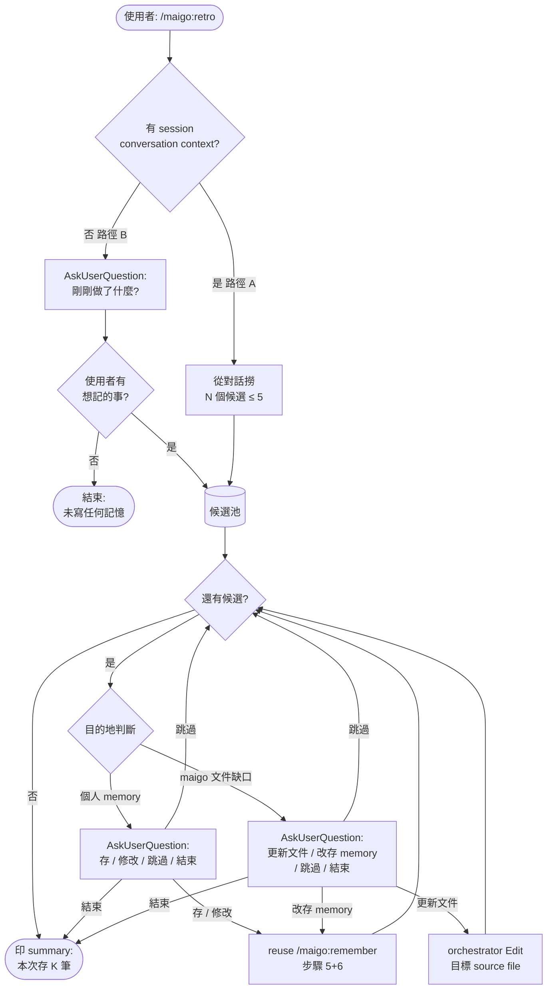

<!-- mkdocs-include-start -->

# /maigo:retro



Session 快結束時，那些「使用者剛指出的偏好」、「約好的慣例」、「學到的教訓」
常常就這樣消失在下一個 prompt 裡。retro 命令把這些抓回來，逐筆問使用者要不要存。

**Orchestrator 親自跑，不開新 agent。**

## 使用

```
/maigo:retro
```

（無參數）

## 流程

### 路徑 A — 同 session（orchestrator 有 conversation context）

1. orchestrator 從 session 對話 context 撈出 **N 個候選 retro 點**（建議 ≤ 5；多於 5 取最有信號的前 5）。

   候選來源：
   - 使用者顯式講的偏好 / 反饋（例：「以後 review 別寫這麼長」）
   - session 中浮現的約定（例：commit message 風格、test naming）
   - 學到的事 / 踩過的雷（例：「這個 lib 在 macOS 行為跟 linux 不同」）

2. **逐筆** propose（一次一筆，不要一口氣全列）：

   - 印一段「候選 #i / N」摘要：原始 context 引用 + orchestrator 推斷的 type / name / description。
   - **先判斷目的地**（印在摘要裡）：
     - `個人 memory`：使用者的偏好、workflow 習慣、跨 session 記憶的事實
     - `maigo 文件缺口`：描述的是「maigo 如何工作 / maigo 的某個慣例 / 實作規範」
       → 應進 maigo 的 source file（例：`docs/reference/memory.md`、`CONTRIBUTING.md`），而不是寫進個人 memory
   - 依目的地調整問法：
     - **個人 memory** → **AskUserQuestion**「要存這筆嗎？」選項：`存` / `修改` / `跳過` / `結束 retro`
     - **maigo 文件缺口** → **AskUserQuestion**「要更新 maigo 文件嗎？」選項：
       `更新 maigo 文件`（orchestrator 直接 Edit 指定 source file）/ `改存 personal memory` / `跳過` / `結束 retro`

3. 使用者選「存」或「修改」→ **reuse `/maigo:remember` 流程步驟 5（AskUserQuestion 確認三題）
   與步驟 6（寫檔 + 更新 MEMORY.md + rollback）**。
   觸發點：把 retro 候選當作 `/maigo:remember` 的 input 自然語言，
   從步驟 2（推斷 type）開始走，一路走完步驟 6。

   使用者選「更新 maigo 文件」→ orchestrator 直接 Edit 目標 source file，完成後印「已更新 `<file>`」，不寫 memory。

4. 該筆寫完 → 回到步驟 2 的下一筆候選。

5. 所有候選跑完，或使用者「結束 retro」→ 印 summary：「本次 retro 存了 K 筆：
   `<name1>`（`<type1>`）、`<name2>`（`<type2>`）...」。

### 路徑 B — 跨 session fallback（orchestrator **無** conversation context）

1. orchestrator 判斷：session 對話 context 為空 / 不存在 / 無有意義 turn → 進入 fallback。

2. **AskUserQuestion** 問使用者：「上次的 session 沒在這條對話裡。剛剛做了什麼任務？
   有沒有想記下來的偏好 / 約定 / 學到的事？」

3. 使用者回覆 → orchestrator 把回覆當「N 個候選 retro 點」的 input，
   從**路徑 A 的步驟 2** 開始跑。

4. 使用者回覆「沒有 / 算了」→ 印「了解，retro 結束，未寫入任何記憶」。

## 中斷處理

- 使用者隨時打斷（送新 prompt、Ctrl+C 之類）→ **已存的保留，未答完的不存**。
- 寫檔失敗（同 `/maigo:remember` 的 atomic-ish rollback）→ 已寫成功的保留，當前這筆按 remember 的 rollback 規則處理。
- 同 slug 已存在 → 沿用 `/maigo:remember` 的三選一處理（覆蓋 / 重命名 / 取消）。

## Orchestrator 守則

- **一次只 propose 一筆**——不要一次列五筆讓使用者勾選；逐筆問，使用者答完才下一筆。
  （理由：勾選 UI 鼓勵草率回答；逐筆強迫使用者真的看過。）
- **目的地優先**——每筆 propose 前先判斷「個人 memory vs maigo 文件缺口」；把 maigo 本身的規則/慣例/實作規範存成個人 memory，是把 plugin 知識放錯地方。
- **不延伸推斷**——只用使用者實際講過 / context 浮現的東西，不要「補充使用者可能也想存的」。
- **不複製 `/maigo:remember` 的寫檔 spec**——指向它就好。寫檔 / index / rollback / 同 slug 處理都遵照 remember 的步驟 6 + 「失敗 / 中斷處理」段。
- **不 delegate 給 Tomori 或 Anon**——orchestrator 自己跑。
- **即時 propose vs retro 的關係**：Soyo / Anon 即時 propose 是前置網；
  retro 是 catch-all 後置網。即使這個 session 已用過即時 propose，retro 仍應照常跑——
  即時 propose 只抓當下明確信號，retro 還能補抓沒講清楚的。
  retro 跑到與即時 propose 重複的候選時，正常展示 MEMORY.md index，
  由使用者眼睛判斷是否重複；orchestrator 不做 keyword dedup。
  已在 confirm flow 存入的 entry（使用者選「存」或「修改」後完成寫檔的），retro 不重複 propose。
  此判斷僅限路徑 A；路徑 B 因無 session context，orchestrator 無法可靠辨別，照常 propose 並讓使用者從 MEMORY.md index 自行判斷是否重複。

→ 寫檔細節：[/maigo:remember](https://github.com/Lee-W/maigo/blob/main/commands/remember.md)

→ 完整 storage spec：[Memory reference](../docs/reference/memory.md)
