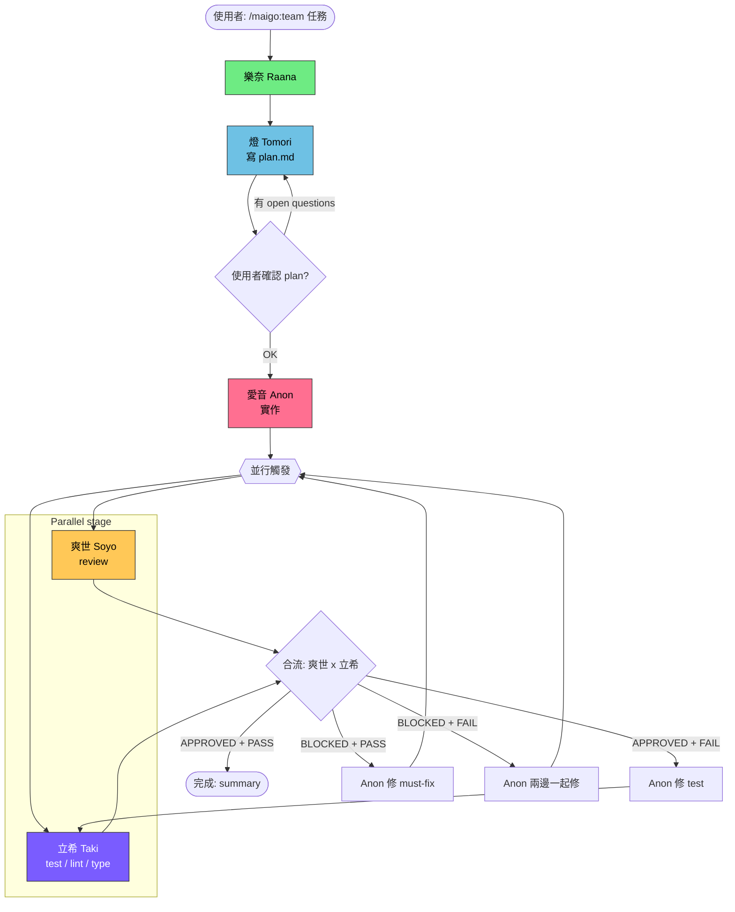

<!-- mkdocs-include-start -->

# /maigo:team



跟 `/maigo:go` 同一條工作流，差別在最後審查 + 驗證階段**並行**。
Soyo 跟 Taki 互不依賴（Soyo 讀 diff、Taki 跑 command），可同時動。

## 使用

```
/maigo:team <任務描述>
/maigo:team --force-sequential <任務描述>    # 退回 /maigo:go 順序版
```

## 流程

**Sequential（必須照順序）**

1. **樂奈 (Raana)** — 探 codebase。「らーなだよ。看完了。相關的在這三個檔案。」
2. **燈 (Tomori)** — 寫 `/tmp/maigo/<repo>/plan.md`。「……讓我先理清楚它想做什麼。」
3. **使用者確認 plan**
4. **愛音 (Anon)** — 按 plan 實作。「OK 那我先做這步！」

**Parallel（同時觸發兩個 Task）**

5a. **爽世 (Soyo)** — review 變更（依 `skills/strict-review`）。「你說的『應該』，是有跑過、還是只是『應該』？」
5b. **立希 (Taki)** — 跑 test / lint / type check。「跑出來爆了，看 line 42。」

6. **合流**——兩邊都回來後一起處理

## Trade-off

| 模式 | Wall clock | 「白做工」風險 |
|------|-----------|--------------|
| `/maigo:go` 順序 | 100% | 0（爽世擋下就不跑 test） |
| `/maigo:team` 並行 | ~60-70% | 中（爽世擋下時，立希已經跑完了） |

多數情況淨值正——大部分變更會通過 review，並行省的時間 > 偶爾白跑 test 的成本。
但若是高風險變更（重構、scope 大）建議用 `/maigo:go` 避免白做工。

## 合流邏輯

| 爽世 | 立希 | 處理 |
|------|------|------|
| APPROVED | PASS | 完成。給使用者 summary |
| APPROVED | FAIL | 回到愛音修 test failure（review 通過不重跑） |
| NEEDS_CHANGES / BLOCKED | PASS | 回到愛音修 must-fix，**修完要重跑 Soyo + Taki**（不能假設 test 還會綠） |
| NEEDS_CHANGES / BLOCKED | FAIL | 回到愛音兩邊一起修，重跑 Soyo + Taki |

## 失敗處理

跟 `/maigo:go` 一樣（見該命令的「失敗處理」）。一樣 3 次同條卡關才停下找使用者。

## `--force-sequential`

使用者明確要求順序版時用。等於把 step 5a/5b 改回 5 → 6（先 Soyo 再 Taki）。
適用場景：
- 變更高風險，不想白跑 test
- Debug 並行流程本身（懷疑兩邊互相影響）

## Memory propose confirm flow

當 Soyo 或 Anon 的輸出末尾含 `## Memory propose` 段時，orchestrator 在該 agent 完成後、繼續下一步前，立刻執行 confirm flow：

1. 檢查 propose 段的 6 個必填欄位（name / slug / description / body / type / rationale）是否齊全。
   缺任一欄位 → 不 confirm，印一行提示「偵測到 propose 段但格式不完整，已跳過」，繼續正常流程。
2. 顯示目前兩個 memory 來源的 index：
   - `~/.config/maigo/memory/MEMORY.md`（cross-project）
   - `~/.claude/projects/<current-project>/memory/MEMORY.md`（per-project，若存在）
3. 印出 propose 摘要（type / name / description / rationale）。
4. **AskUserQuestion**，選項：`存` / `修改` / `跳過`。
5. 選「存」或「修改」→ reuse `/maigo:remember` 步驟 5+6
   （以 propose 的欄位為預填值；「修改」時步驟 5 讓使用者改各欄位）。
6. 選「跳過」→ 繼續正常流程，不寫任何檔。

**並行場景規則**：Soyo 和 Taki 並行時，若 Soyo 輸出含 `## Memory propose`，
等**兩邊都回來後**再跑 confirm flow，不要插在 Taki 還在執行中間。

## Orchestrator 守則

- **真的並行**：用一條 message 內兩個 Task tool call 觸發 Soyo 和 Taki
- **不要假裝並行**（先 Soyo 完才呼叫 Taki 不算）
- 合流時把兩份輸出**分開呈現**給使用者，不要混在一起
- 其餘規則承襲 `/maigo:go`（不能跳關、不能放水、不能因為輪數多了打折）
- 偵測 `## Memory propose` 標頭時，只掃描 code fence 外的行；
  code block 內（triple-backtick fence 之間）的同名標頭不觸發 confirm flow。
  追蹤法：從輸出文字開頭往下追蹤 triple-backtick 計數（奇數 → in-fence），遇到 `^## Memory propose` 且 in-fence 為 true 時跳過。
