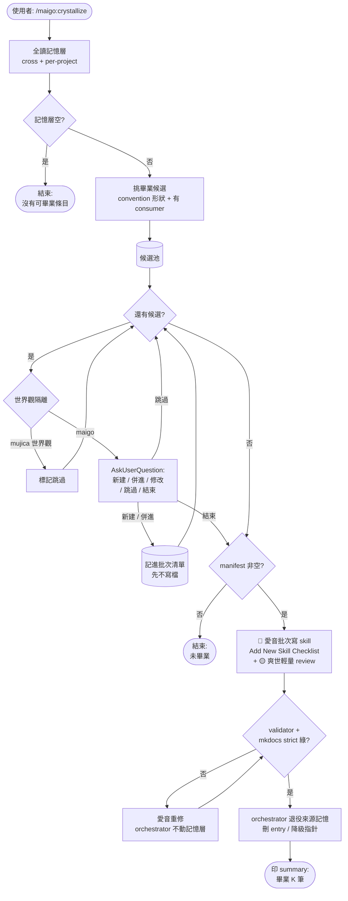

```mermaid
flowchart TD
    Start([使用者: /maigo:crystallize]) --> Load[全讀記憶層<br/>cross + per-project]
    Load --> Empty{記憶層空?}
    Empty -- 是 --> EndEmpty([結束:<br/>沒有可畢業條目])
    Empty -- 否 --> Pick[挑畢業候選<br/>convention 形狀 + 有 consumer]
    Pick --> Pool[(候選池)]
    Pool --> Next{還有候選?}
    Next -- 是 --> Gate{世界觀隔離}
    Gate -- mujica 世界觀 --> Skip[標記跳過] --> Next
    Gate -- maigo --> Ask[AskUserQuestion:<br/>新建 / 併進 / 修改<br/>/ 跳過 / 結束]
    Ask -- 跳過 --> Next
    Ask -- 新建 / 併進 --> Manifest[(記進批次清單<br/>先不寫檔)]
    Manifest --> Next
    Ask -- 結束 --> Dispatch
    Next -- 否 --> Dispatch{manifest 非空?}
    Dispatch -- 否 --> EndNone([結束:<br/>未畢業])
    Dispatch -- 是 --> Anon[🎀 愛音批次寫 skill<br/>Add New Skill Checklist<br/>+ 🟡 爽世輕量 review]
    Anon --> Verify{validator +<br/>mkdocs strict 綠?}
    Verify -- 否 --> FixSkill[愛音重修<br/>orchestrator 不動記憶層] --> Verify
    Verify -- 是 --> Retire[orchestrator 退役來源記憶<br/>刪 entry / 降級指針]
    Retire --> Summary([印 summary:<br/>畢業 K 筆])
```


