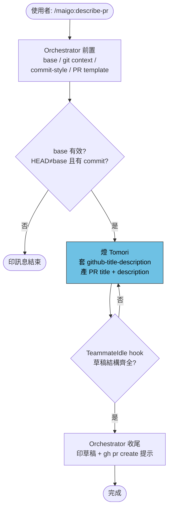

```mermaid
flowchart TD
    Start([使用者: /maigo:describe-pr]) --> Prep[Orchestrator 前置<br/>base / git context /<br/>commit-style / PR template]
    Prep --> Gate{base 有效?<br/>HEAD≠base 且有 commit?}
    Gate -- 否 --> Stop([印訊息結束])
    Gate -- 是 --> Tomori[燈 Tomori<br/>套 github-title-description<br/>產 PR title + description]
    Tomori --> Hook{TeammateIdle hook<br/>草稿結構齊全?}
    Hook -- 否 --> Tomori
    Hook -- 是 --> Finish[Orchestrator 收尾<br/>印草稿 + gh pr create 提示]
    Finish --> Done([完成])

    classDef tomori fill:#6EC1E4,stroke:#333,color:#000
    class Tomori tomori
```


