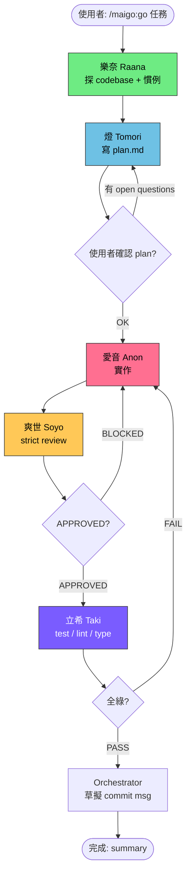

```mermaid
flowchart TD
    Start([使用者: /maigo:go 任務]) --> Raana[樂奈 Raana<br/>探 codebase + 慣例]
    Raana --> Tomori[燈 Tomori<br/>寫 plan.md]
    Tomori --> Confirm{使用者確認 plan?}
    Confirm -- 有 open questions --> Tomori
    Confirm -- OK --> Anon[愛音 Anon<br/>實作]
    Anon --> Soyo[爽世 Soyo<br/>strict review]
    Soyo --> SoyoVerdict{APPROVED?}
    SoyoVerdict -- BLOCKED --> Anon
    SoyoVerdict -- APPROVED --> Taki[立希 Taki<br/>test / lint / type]
    Taki --> TakiVerdict{全綠?}
    TakiVerdict -- FAIL --> Anon
    TakiVerdict -- PASS --> Commit[Orchestrator<br/>草擬 commit msg]
    Commit --> Done([完成: summary])

    classDef raana fill:#6EEB83,stroke:#333,color:#000
    classDef tomori fill:#6EC1E4,stroke:#333,color:#000
    classDef anon fill:#FF6F91,stroke:#333,color:#000
    classDef soyo fill:#FFC857,stroke:#333,color:#000
    classDef taki fill:#7A5CFF,stroke:#333,color:#fff
    class Raana raana
    class Tomori tomori
    class Anon anon
    class Soyo soyo
    class Taki taki
```


