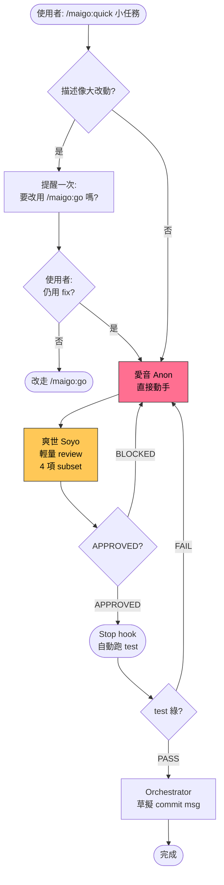

```mermaid
flowchart TD
    Start([使用者: /maigo:quick 小任務]) --> Gate{描述像大改動?}
    Gate -- 是 --> Warn[提醒一次:<br/>要改用 /maigo:go 嗎?]
    Warn --> UserChoose{使用者:<br/>仍用 fix?}
    UserChoose -- 否 --> Redirect([改走 /maigo:go])
    UserChoose -- 是 --> Anon
    Gate -- 否 --> Anon[愛音 Anon<br/>直接動手]
    Anon --> Soyo[爽世 Soyo<br/>輕量 review<br/>4 項 subset]
    Soyo --> SoyoVerdict{APPROVED?}
    SoyoVerdict -- BLOCKED --> Anon
    SoyoVerdict -- APPROVED --> StopHook([Stop hook<br/>自動跑 test])
    StopHook --> HookVerdict{test 綠?}
    HookVerdict -- FAIL --> Anon
    HookVerdict -- PASS --> Commit[Orchestrator<br/>草擬 commit msg]
    Commit --> Done([完成])

    classDef raana fill:#6EEB83,stroke:#333,color:#000
    classDef tomori fill:#6EC1E4,stroke:#333,color:#000
    classDef anon fill:#FF6F91,stroke:#333,color:#000
    classDef soyo fill:#FFC857,stroke:#333,color:#000
    classDef taki fill:#7A5CFF,stroke:#333,color:#fff
    class Anon anon
    class Soyo soyo
```


