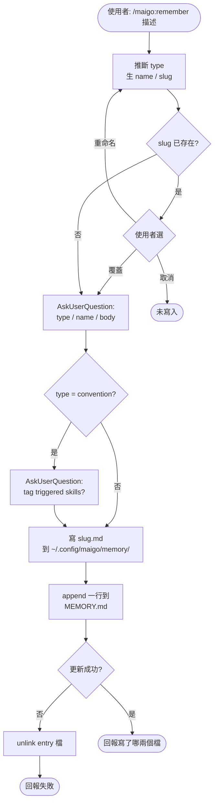

```mermaid
flowchart TD
    Start([使用者: /maigo:remember 描述]) --> Infer[推斷 type<br/>生 name / slug]
    Infer --> Collision{slug 已存在?}
    Collision -- 是 --> Resolve{使用者選}
    Resolve -- 覆蓋 --> Ask3
    Resolve -- 重命名 --> Infer
    Resolve -- 取消 --> Cancel([未寫入])
    Collision -- 否 --> Ask3[AskUserQuestion:<br/>type / name / body]
    Ask3 --> TypeCheck{type = convention?}
    TypeCheck -- 是 --> Ask4[AskUserQuestion:<br/>tag triggered skills?]
    TypeCheck -- 否 --> Write
    Ask4 --> Write[寫 slug.md<br/>到 ~/.config/maigo/memory/]
    Write --> Index[append 一行到<br/>MEMORY.md]
    Index --> IndexOK{更新成功?}
    IndexOK -- 否 --> Rollback[unlink entry 檔]
    Rollback --> Fail([回報失敗])
    IndexOK -- 是 --> Done([回報寫了哪兩個檔])
```


