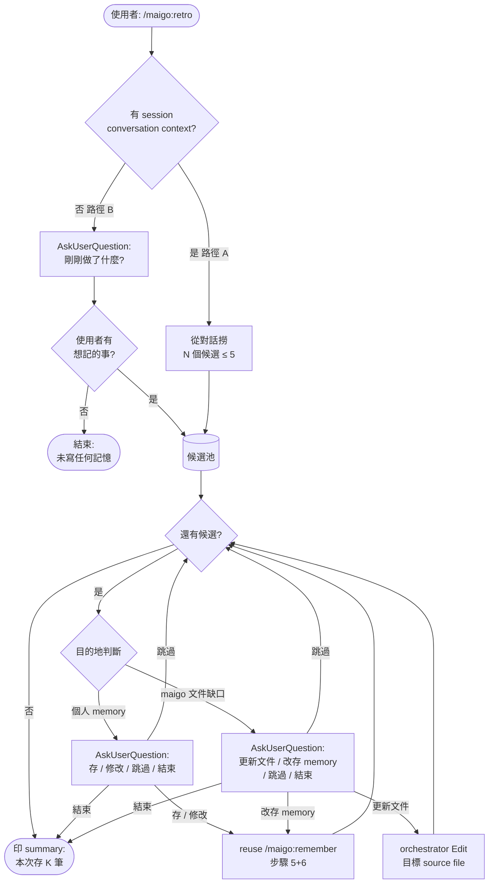

```mermaid
flowchart TD
    Start([使用者: /maigo:retro]) --> CtxCheck{有 session<br/>conversation context?}
    CtxCheck -- 否 路徑 B --> Ask[AskUserQuestion:<br/>剛剛做了什麼?]
    Ask --> AskResult{使用者有<br/>想記的事?}
    AskResult -- 否 --> EndEmpty([結束:<br/>未寫任何記憶])
    AskResult -- 是 --> Pool
    CtxCheck -- 是 路徑 A --> Extract[從對話撈<br/>N 個候選 ≤ 5]
    Extract --> Pool[(候選池)]
    Pool --> Next{還有候選?}
    Next -- 否 --> Summary([印 summary:<br/>本次存 K 筆])
    Next -- 是 --> Dest{目的地判斷}
    Dest -- 個人 memory --> AskSave[AskUserQuestion:<br/>存 / 修改 / 跳過 / 結束]
    Dest -- maigo 文件缺口 --> AskDoc[AskUserQuestion:<br/>更新文件 / 改存 memory<br/>/ 跳過 / 結束]
    AskSave -- 存 / 修改 --> Remember[reuse /maigo:remember<br/>步驟 5+6]
    AskSave -- 跳過 --> Next
    AskSave -- 結束 --> Summary
    AskDoc -- 更新文件 --> EditDoc[orchestrator Edit<br/>目標 source file]
    AskDoc -- 改存 memory --> Remember
    AskDoc -- 跳過 --> Next
    AskDoc -- 結束 --> Summary
    Remember --> Next
    EditDoc --> Next
```


