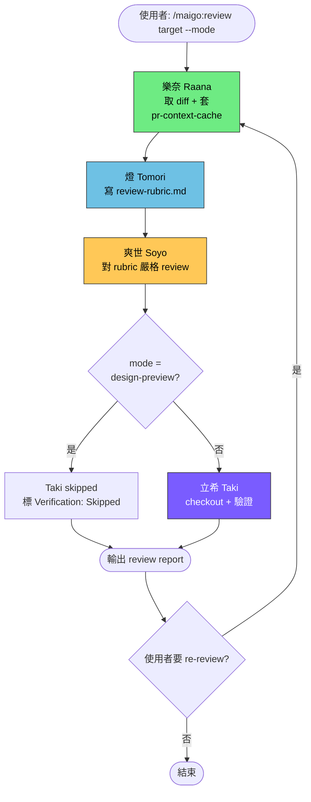

```mermaid
flowchart TD
    Start([使用者: /maigo:review target --mode]) --> Raana[樂奈 Raana<br/>取 diff + 套<br/>pr-context-cache]
    Raana --> Tomori[燈 Tomori<br/>寫 review-rubric.md]
    Tomori --> Soyo[爽世 Soyo<br/>對 rubric 嚴格 review]
    Soyo --> ModeCheck{mode =<br/>design-preview?}
    ModeCheck -- 是 --> Skip[Taki skipped<br/>標 Verification: Skipped]
    ModeCheck -- 否 --> Taki[立希 Taki<br/>checkout + 驗證]
    Skip --> Report([輸出 review report])
    Taki --> Report
    Report --> ReReview{使用者要 re-review?}
    ReReview -- 是 --> Raana
    ReReview -- 否 --> Done([結束])

    classDef raana fill:#6EEB83,stroke:#333,color:#000
    classDef tomori fill:#6EC1E4,stroke:#333,color:#000
    classDef anon fill:#FF6F91,stroke:#333,color:#000
    classDef soyo fill:#FFC857,stroke:#333,color:#000
    classDef taki fill:#7A5CFF,stroke:#333,color:#fff
    class Raana raana
    class Tomori tomori
    class Soyo soyo
    class Taki taki
```


