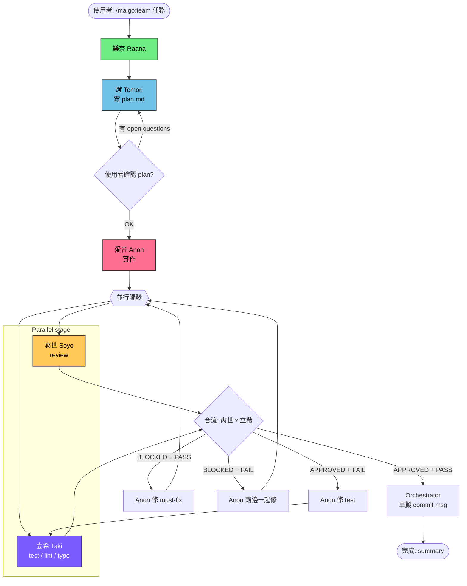

```mermaid
flowchart TD
    Start([使用者: /maigo:team 任務]) --> Raana[樂奈 Raana]
    Raana --> Tomori[燈 Tomori<br/>寫 plan.md]
    Tomori --> Confirm{使用者確認 plan?}
    Confirm -- 有 open questions --> Tomori
    Confirm -- OK --> Anon[愛音 Anon<br/>實作]
    Anon --> Fork{{並行觸發}}
    subgraph Parallel [Parallel stage]
        direction LR
        Soyo[爽世 Soyo<br/>review]
        Taki[立希 Taki<br/>test / lint / type]
    end
    Fork --> Soyo
    Fork --> Taki
    Soyo --> Join{合流: 爽世 x 立希}
    Taki --> Join
    Join -- APPROVED + PASS --> Commit[Orchestrator<br/>草擬 commit msg]
    Commit --> Done([完成: summary])
    Join -- APPROVED + FAIL --> AnonFixTest[Anon 修 test]
    Join -- BLOCKED + PASS --> AnonFixMust[Anon 修 must-fix]
    Join -- BLOCKED + FAIL --> AnonFixBoth[Anon 兩邊一起修]
    AnonFixTest --> Taki
    AnonFixMust --> Fork
    AnonFixBoth --> Fork

    classDef raana fill:#6EEB83,stroke:#333,color:#000
    classDef tomori fill:#6EC1E4,stroke:#333,color:#000
    classDef anon fill:#FF6F91,stroke:#333,color:#000
    classDef soyo fill:#FFC857,stroke:#333,color:#000
    classDef taki fill:#7A5CFF,stroke:#333,color:#fff
    class Raana raana
    class Tomori tomori
    class Anon anon
    class Soyo soyo
    class Taki taki
```


