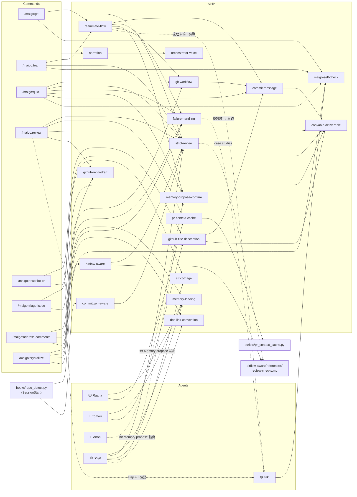

# Skills Reference

Skill 是跨 agent / command 引用的共用流程模組。內容寫一次、多處引用，
比塞進每個 agent 的長 prompt 更不容易被「自動省略」。

每個 skill 一個目錄：`skills/<name>/SKILL.md`。
Source-of-truth 是 `skills/*/SKILL.md` 本身；本頁只是 catalog。

## 為什麼用 skill 而不是直接寫進 agent

不用 skill 的寫法：

```
agents/Soyo.md (200 行：包含 checklist + 評審原則 + 輸出格式 + ...)
agents/Soyo 被呼叫 → 整份 prompt 送進 context → 細節容易被 LLM 自動「跳過」
```

用 skill 的寫法：

```
agents/Soyo.md：人設 + 引用 skills/strict-review（保持短，只放角色）
skills/strict-review/SKILL.md：完整 checklist + 原則 + 格式
agent 收到指引時，skill 內容會 on-demand 被拉進來，訊號明確（標題「Strict Review」引導注意力）
```

額外好處：
- 一處更新（改 checklist 不用同步多個 agent prompt）
- 多個 consumer 共用（`/maigo:go` 和 `/maigo:review` 都用 Soyo + strict-review）
- 跟 agent 個性解耦（換個 reviewer 角色也能套同個 skill）

## Skill catalog

| Skill | Owner agent | Consumers | 摘要 |
|-------|-------------|-----------|------|
| [`strict-review`](../skills/strict-review.md) | Soyo | `/maigo:go` step 5、`/maigo:review` step 3 | 預設 BLOCKED + 9 項 checklist + evidence-driven |
| [`airflow-aware`](../skills/airflow-aware.md) | — (知識層) | 任何 skill（在 apache-airflow contributor checkout 時由 repo-detect hook 自動載入） | Airflow contributor 慣例：Dag 命名規則、Breeze/uv 環境、Ruff/Mypy 風格、coding rules、pytest patterns、PR hygiene（英文） |
| [`commitizen-aware`](../skills/commitizen-aware.md) | — (知識層) | 任何 skill（在 commitizen-tools/commitizen contributor checkout 時由 repo-detect hook 自動載入） | commitizen contributor 慣例：uv + poe 任務、Conventional Commits 自舉、ruff/mypy lint、pytest、PR guidelines（英文） |
| [`commit-message`](../skills/commit-message.md) | — (orchestrator 直跑) | `/maigo:go` step 7、`/maigo:quick` step 4、`/maigo:team` step 7 | 從 diff 草擬 user-impact subject + 短 body 的 commit message，避免把 PR motivation 倒進 commit log |
| [`failure-handling`](../skills/failure-handling.md) | — (流程層) | `/maigo:go` 失敗處理段、`/maigo:quick` 同段、`/maigo:team` 同段、`/maigo:address-comments` step 5 | 爽世擋下 / 立希驗證紅 / 2 次同條停下找使用者的共用流程 |
| [`github-title-description`](../skills/github-title-description.md) | Tomori | `/maigo:describe-pr` step 2 | 從 branch commits / diff 產 user-impact PR title + Why / What / Test Plan |
| [`pr-context-cache`](../skills/pr-context-cache.md) | Raana | `/maigo:review` step 1 | 把 PR title/body/diff/CI status/linked issues cache 到 review-rubric.md，re-review 時跳過重抓 |
| [`memory-loading`](../skills/memory-loading.md) | Raana / Tomori / Soyo | 全部 agent 啟動時 | 跨專案記憶載入 5 步流程、schema 自檢、fallback 規則、10 筆上限 |
| [`memory-propose-confirm`](../skills/memory-propose-confirm.md) | orchestrator | `/maigo:go`、`/maigo:quick`、`/maigo:team`、`/maigo:review` | Memory propose 的 confirm flow、存 / 跳過 / 未決三態（no-answer ≠ 跳過）、fence-tracking 規則、並行模式追加 |
| [`narration`](../skills/narration.md) | orchestrator | 全部 `/maigo:*` 命令 | maigo orchestrator 的旁白——🌙 Doloris / 🌑 Mortis 在開場 / 收場 / 卡關節點框住整場演出 |
| [`teammate-flow`](../skills/teammate-flow.md) | orchestrator | `/maigo:go`、`/maigo:team` | MyGO!!!!! 五人協作的共通流程骨架——sequential 段（🐱 樂奈 → 🩵 燈 → 🎀 愛音）、Orchestrator 守則、commit message draft 規則、失敗處理與 memory confirm flow 引用 |
| [`doc-link-convention`](../skills/doc-link-convention.md) | Soyo | review 觸及 `agents/` / `commands/` / `skills/` 的 PR 時 | Maigo source 檔的跨檔 link 強制用絕對 GitHub URL，避免 `mkdocs build --strict` 因 include-markdown rewrite 抓不到 page 而 abort |
| [`maigo-self-check`](../skills/maigo-self-check.md) | Taki | `/maigo:go`、`/maigo:quick`、`/maigo:team`、`/maigo:crystallize` | diff 動到 agents/commands/skills/docs/mkdocs.yml 時，以 validate_plugin + mkdocs --strict 取代純 pytest 作為驗證標準 |
| [`strict-triage`](../skills/strict-triage.md) | Soyo | `/maigo:triage-issue` step 3 | 預設 NEEDS_INFO + 9 項 issue triage checklist + 4 verdict（READY / NEEDS_INFO / DUP / CLOSE）+ 草擬 gh 指令 |
| [`copyable-deliverable`](../skills/copyable-deliverable.md) | orchestrator | `/maigo:review`、`/maigo:triage-issue`、`/maigo:describe-pr` 的 deliverable 輸出 + `github-title-description` / `commit-message` skill | deliverable（PR comment / reply draft / commit message / gh 指令草稿）放單一 fenced code block，給 raw markdown 可一鍵複製 |
| [`orchestrator-voice`](../skills/orchestrator-voice.md) | orchestrator | 全部 `/maigo:*` 命令（與 `narration` 並用） | 對話本體的互動節奏與用詞——AskUserQuestion widget discipline、台灣漢語口語選詞 |
| [`github-reply-draft`](../skills/github-reply-draft.md) | — (orchestrator/agent 草稿時引用) | `/maigo:address-comments`（逐 thread 回覆）、`/maigo:review` | 草擬 GitHub PR review thread 回覆的 6 條慣例：預設簡短、不引 SHA、只提最終 diff 裡的 symbol、一 thread 一則、不過度宣稱已解決、保留 attribution footer |
| [`git-workflow`](../skills/git-workflow.md) | — (orchestrator 直跑) | `/maigo:go`、`/maigo:quick`、`/maigo:team`、`/maigo:address-comments`（commit-assembly 步驟） | Git commit 組裝慣例：明確 stage 檔案（不用 `-A`）、不 `cd`（用絕對路徑 / `git -C`）、unreleased commit 的 polish 用 amend（含 tangled-hunk 例外）、CI 分支上修 CI 失敗、對正確 baseline（merge target）量 diff 大小 |

## Skill 相依圖

手繪維護的相依總覽——command / agent 引用哪些 skill、skill 之間誰引用誰、
progressive-disclosure 的 references 檔掛在哪個 skill 下。新增 skill 或改相依時
**同步更新本圖**（`validate_plugin.py` 的 `check_skills_graph` 會擋漏掉的 skill 節點）。



讀圖說明：

- **實線** = 引用 / 載入（command、agent 或 skill 的文件指向某 skill）
- **虛線** = 觸發關係（🎀 Anon / 🟡 Soyo 的 `## Memory propose` 輸出觸發 orchestrator
  的 confirm flow；`strict-review` 在 Airflow review 時去讀案例檔；流程末端觸發
  🟣 Taki 驗證）
- **🟣 Taki 只有入邊、沒有出邊**——立希被 teammate-flow / `/maigo:review` /
  failure-handling 的流程步驟觸發來驗證，但他自己不載入任何 skill，驗證規格全在
  [`agents/Taki.md`](https://github.com/Lee-W/maigo/blob/main/agents/Taki.md) 本體

## skill 檔案規格

```yaml
---
name: <skill-name>           # 必填，需與目錄名一致
description: This skill should be used when ...    # 必填
---

# <Title>

## Overview / 為什麼這個 skill 存在
...

## 主要內容
...
```

`description` 欄位很重要——Claude 在判斷該不該拉某個 skill 進來時讀的就是這欄。
寫成 `This skill should be used when ...` 模式比較容易被正確匹配。

## Memory-triggered skill 載入

skill 也可以被 memory entry 觸發載入——不需要在 agent prompt 裡直接引用。

機制：`type: project` 的 entry 可在 frontmatter 加 `triggers: [<skill-name>]` 欄位。
Soyo 在跨專案記憶 v1.1 之後支援此機制：載入 project entry 時，
對每個 triggered skill name 嘗試讀 `skills/<name>/SKILL.md`，
存在就附加為 base 9 項 checklist 之後的 item 10+；
不存在 → log「triggered skill `<name>` 找不到，忽略」，不 crash。

**注意**：只有 `type: project` 的 entry 適用 `triggers`——
`user` / `feedback` / `reference` type 的 triggers 欄位會被無聲忽略。

詳見 [`memory.md` frontmatter schema](memory.md#entry-frontmatter-schema) 與
[`strict-review/SKILL.md` Domain skill composition 段](../skills/strict-review.md#domain-skill-composition)。

## Progressive disclosure：`references/` 子目錄

skill 是**目錄**不是單檔。SKILL.md 本體在 skill 觸發時整份進 context；
目錄下的其他檔案（慣例：`references/<topic>.md`）**只在被 Read 時才付 token**。

- 展開內容多、又非每次觸發都需要（review-only checks、案例敘事、罕見情境診斷）
  → 放 `references/`，SKILL.md 本體留摘要 + 「何時去讀」的指示
- SKILL.md 本體超過 ~150 行 → 預設考慮拆 references/
- references 檔不進 docs nav、不需要 shim（agent-facing，不是 docs page）；
  SKILL.md 指向它時用 inline code 路徑（如 `references/review-checks.md`），
  **不要用 markdown link**——include-markdown 的 rewrite 會把它指到不存在的 docs 路徑，
  炸 `mkdocs build --strict`
- 範例：[`skills/airflow-aware/references/review-checks.md`](https://github.com/Lee-W/maigo/blob/main/skills/airflow-aware/references/review-checks.md)

## Add New Skill Checklist

1. `mkdir skills/<new-name>/` + 寫 `skills/<new-name>/SKILL.md`
   （frontmatter `name` 必須等於目錄名，內文要有 `<!-- mkdocs-include-start -->` 標記；
   展開內容多的部分依上節拆 `references/`）
2. `docs/skills/<new-name>.md` — 寫 include-markdown shim（單行 include 指令，
   `start="<!-- mkdocs-include-start -->"`）。直接複製
   [`docs/skills/strict-review.md`](https://github.com/Lee-W/maigo/blob/main/docs/skills/strict-review.md)
   換掉路徑即可
3. `mkdocs.yml` 的 `Skills (source):` 段加一條 `- <new-name>: skills/<new-name>.md`
4. 這份 catalog 表加一列（Owner / Consumers / 摘要）
5. 在 owner agent 的 prompt 加引用：「process 依 `skills/<new-name>/SKILL.md`」
6. 跑 `python3 scripts/validate_plugin.py`（cross-ref + 上述 alignment 檢查）
   與 `uv run mkdocs build --strict`（doc link rewrite 不報缺檔）

第 1–4 步漏掉任何一條 → `check_skills_docs_alignment` 會擋下。

另外：上方「Skill 相依圖」的 mermaid 要同步加節點與相依邊——
漏掉 skill 節點時 `check_skills_graph` 會擋下。
